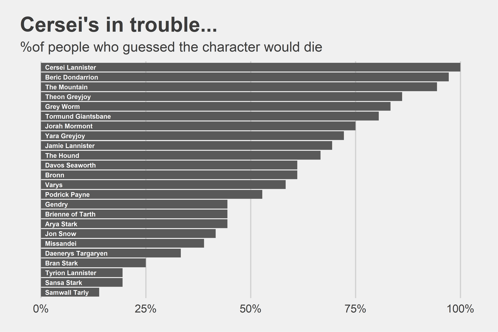

```{r setup, include=FALSE}
knitr::opts_chunk$set(echo = TRUE)
```

This month sees the return of HBO's hit series Game of Thrones for it's final six episodes.  To celebrate the finale, my office started a GoT betting pool.  It's all the fun of March Madness, but with a topic I actually know!

The rules of the game were taken from [this Reddit post](https://www.reddit.com/r/gameofthrones/comments/akq0rm/spoilers_game_of_thrones_season_8_deadpool_is/).  The primary goal of the game is to guess which of the 24 characters shown will be dead or alive by the end of the series (with bonus points if you guess the episode they die and whether or not they become a wight).


[{width=500px}](https://www.reddit.com/r/gameofthrones/comments/akq0rm/spoilers_game_of_thrones_season_8_deadpool_is/)


A total of 36 people entered into the pool, and with 24 characters per entry, that's 864 total guesses for who will live and who will die.  That's a great sample size that allows us to see whether there's any patterns in people's choices.


## Summary metrics

I began by reading the entries in R and computing some simple summary metrics.  For starters, what proportion of entries picked each character to die?

<center>

{width=750px}

</center>

Across all of the entries, people picked characters to die at a rate of 57.6%, or just shy of 14 out of the 24 characters being killed off.  Most expect Samwall Tarly to make it through unscathed, but not a single person thinks Cersei is still going to be around by the end.
